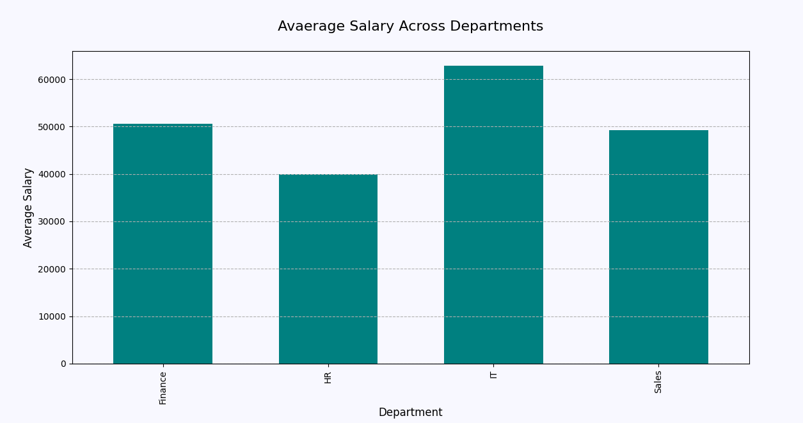

# 📊 Python Mini Project – Employee Salary Analysis

## 📌 Project Objective

The objective of this project is to perform basic data analysis on an employee salary dataset and answer common business questions using Python. The project also demonstrates how data can be visualized using Matplotlib.

## 📖 Project Overview

The dataset was prepared using **Google Sheets** and analyzed using **Python**. **Pandas** was used for data exploration and analysis, while **Matplotlib** was used to create visualizations that provide meaningful business insights.

## 📁 Dataset

The dataset contains the following information:

- Employee ID
- Employee Name
- Department
- Salary
- Experience

## ❓ Business Questions Solved

- What is the average salary?
- What is the highest salary?
- What is the lowest salary?
- How many employees are there in each department?
- What is the average salary across departments?
- Which employee has the highest salary?
- Which employees have more than 5 years of experience?
- Which department has the highest average salary?
- Which department has the most employees?

## 🛠️ Tools Used

- Google Sheets (Dataset Preparation)
- Python
- Pandas
- Matplotlib

## 📈 Visualizations

- Average Salary Across Departments (Bar Chart)
- Employee Distribution Across Departments (Pie Chart)

### Average Salary Across Departments

### Employee Distribution Across Departments

## 📂 Project Files

- Employee_Salary.csv
- Employee_Salary_Analysis.py
- average_salary_across_departments.png
- employee_distribution_across_department.png
- salary_analysis_output.png

## 🎯 Key Learnings

Through this project, I learned how to:

- Prepare datasets using Google Sheets
- Read CSV files using Pandas
- Explore and analyze data
- Answer business questions using Python
- Create data visualizations using Matplotlib
- Organize a Python data analytics project

## 👤 Created By

Arshin Sheikh
